# Constitución de la Aplicación — Mi Conjunto

## Tabla de contenidos

1. [Preámbulo](#1-preámbulo)
2. [Objeto y alcance](#2-objeto-y-alcance)
3. [Principios constitucionales del producto](#3-principios-constitucionales-del-producto)
4. [Actores y roles](#4-actores-y-roles)
5. [Dominios y módulos](#5-dominios-y-módulos)
6. [Límites explícitos (no-objetivos)](#6-límites-explícitos-no-objetivos)
7. [Identidad visual y sistema de interfaz](#7-identidad-visual-y-sistema-de-interfaz)
8. [Enmiendas y versionado](#8-enmiendas-y-versionado)
9. [Glosario](#9-glosario)
10. [Diagrama de arquitectura funcional](#10-diagrama-de-arquitectura-funcional)

---

## 1. Preámbulo

**Mi Conjunto** es una plataforma web y móvil para la **administración integral de copropiedades** bajo el régimen de propiedad horizontal. Integra operación, finanzas, gobernanza y relación directa con copropietarios en un único sistema de información.

Su propósito es reemplazar procesos manuales, dispersos o informales por flujos digitales trazables, transparentes y accesibles según el rol de cada usuario.

---

## 2. Objeto y alcance

### 2.1 Objeto

Digitalizar y estandarizar los procesos de administración de propiedad horizontal, garantizando trazabilidad y transparencia hacia copropietarios y órganos de dirección.

### 2.2 Alcance funcional

El alcance funcional queda definido por los dominios listados en la [sección 5](#5-dominios-y-módulos). Cualquier funcionalidad fuera de esos dominios requiere una enmienda formal a este documento antes de entrar al backlog de desarrollo.

### 2.3 Alcance geográfico y jurídico

El software **no sustituye asesoría legal ni contable**. Se adaptará a la normativa local de cada jurisdicción mediante configuración (parámetros, plantillas, reglas de negocio editables) y documentación de cumplimiento, sin incorporar interpretación jurídica directa en el código.

---

## 3. Principios constitucionales del producto

Estos principios rigen todas las decisiones de diseño, arquitectura e implementación. Su modificación requiere enmienda formal.

| Principio | Descripción |
|---|---|
| **Transparencia** | Estados de cuenta, actas y documentos accesibles según rol, sin opacidad innecesaria. |
| **Trazabilidad** | Auditoría de cambios críticos: finanzas, coeficientes, votaciones y datos maestros. |
| **Segregación de funciones** | Permisos por rol (administración, contabilidad, consejo, copropietario, recepción); ningún rol concentra todas las capacidades. |
| **Unidad de verdad** | Un solo maestro de unidades, personas y saldos; se prohíben duplicidades inconsistentes entre módulos. |
| **Seguridad y privacidad** | Mínimo privilegio, datos personales protegidos y retención acorde a la política definida por la copropiedad y la ley aplicable. |
| **Evolución controlada** | Los cambios al alcance se reflejan primero en este documento (versionado) y luego en el backlog de producto. |

---

## 4. Actores y roles

| Actor | Descripción | Acceso esperado |
|---|---|---|
| **Empresa administradora** | Entidad que gestiona una o varias copropiedades. Multi-copropiedad es capacidad evolutiva explícita. | Administración global. |
| **Administrador / equipo operativo** | Responsable del día a día: finanzas, mantenimiento, comunicaciones. | Lectura y escritura en todos los módulos de su copropiedad. |
| **Contabilidad / tesorería** | Gestión financiera, conciliación, reportes contables. | Módulo de finanzas completo; lectura limitada en otros módulos. |
| **Consejo de administración** | Órgano de supervisión elegido por la asamblea. | Vistas y acciones acotadas; aprobaciones según reglamento. |
| **Copropietario / residente / arrendatario** | Usuarios finales del portal. | Consulta de estados de cuenta, documentos, PQRS, comunidad. |
| **Proveedores externos** | Prestadores de servicios con contrato. | Datos de contacto y contratos; no necesariamente usuarios del sistema en v1. |

---

## 5. Dominios y módulos

Cada dominio se define por su **propósito**, sus **datos maestros clave** y los **resultados esperados**. Las historias de usuario detalladas se desarrollan fuera de este documento.

### 5.1 Maestro de copropiedad y personas

**Propósito**: centralizar la información de las unidades y las personas vinculadas a la copropiedad.

- Unidades (apartamentos, locales, parqueaderos, depósitos) con coeficientes, tipología y estado.
- Propietarios, arrendatarios y residentes con roles, vigencias y datos de contacto.
- Historial de titularidad y cambios de ocupación.
- Proveedores de servicios y contratos asociados.

**Resultado esperado**: fuente única y confiable de quién es quién y qué unidad le corresponde.

### 5.2 Finanzas y cartera

**Propósito**: gestionar el ciclo financiero completo de la copropiedad con trazabilidad.

- Presupuesto anual por rubros y aprobación (junta/consejo).
- Cuotas ordinarias y extraordinarias, prorrateo por coeficiente o reglamento interno.
- Liquidación de expensas, notas de cobro, estados de cuenta.
- Cartera: saldos, mora, acuerdos de pago, intereses cuando aplique.
- Tesorería: conciliación bancaria, movimientos, caja menor, comprobantes.
- Contabilidad (plan de cuentas, libro diario, balance, P&G) o integración con software contable externo.
- Pagos en línea (pasarela, PSE, tarjeta) como capacidad evolutiva explícita.

**Resultado esperado**: información financiera al día, conciliada y disponible para copropietarios y órganos de dirección.

### 5.3 Asambleas, junta y gobernanza

**Propósito**: soportar el ciclo de gobierno de la copropiedad de manera digital y trazable.

- Convocatorias con verificación de quórum.
- Actas digitales con trazabilidad de aprobación.
- Votaciones (presencial, mixta o en línea) con ponderación por coeficiente cuando aplique.
- Sesiones de consejo de administración: compromisos y seguimiento.
- Reglamento de propiedad horizontal y manual de convivencia como documentos versionados de referencia.

**Resultado esperado**: gobierno de la copropiedad documentado, auditable y accesible.

### 5.4 Mantenimiento y operaciones

**Propósito**: gestionar activos, mantenimiento y zonas comunes de forma planificada.

- Inventario de activos (ascensores, plantas eléctricas, bombas, CCTV).
- Órdenes de trabajo (correctivo / preventivo), asignación de técnicos, SLA, fotos y evidencias.
- Planes de mantenimiento por calendario y checklist.
- Áreas comunes y reservas (salón social, piscina, canchas) con reglas y calendario.

**Resultado esperado**: reducción de mantenimiento reactivo, trazabilidad de intervenciones y gestión ordenada de zonas comunes.

### 5.5 Portería, seguridad y acceso

**Propósito**: registrar el flujo de personas y eventos de seguridad.

- Registro de visitantes y entregas (QR, listas de acceso).
- Incidentes (novedades, emergencias, daños).
- Integración con control de acceso físico como extensión futura explícita.

**Resultado esperado**: bitácora digital de acceso e incidentes, consultable y auditable.

### 5.6 Comunicaciones

**Propósito**: mantener informada a la comunidad de forma segmentada y oportuna.

- Comunicados por torre, unidad o rol; acuse de lectura opcional.
- Notificaciones (email, SMS, push en app).
- Portal del copropietario: consulta de estados de cuenta, documentos y PQRS.

**Resultado esperado**: información relevante llega al destinatario correcto sin ruido.

### 5.7 PQRS y convivencia

**Propósito**: canalizar y resolver peticiones, quejas, reclamos y sugerencias de forma trazable.

- Radicación y trazabilidad de solicitudes con estados claros.
- Posible vínculo con procesos disciplinarios documentados según reglamento y con debido proceso.

**Resultado esperado**: los residentes tienen un canal formal; la administración tiene métricas de respuesta.

### 5.8 Documentos y cumplimiento

**Propósito**: centralizar documentos normativos y contractuales con alertas de vencimiento.

- Repositorio de actas, pólizas, certificados, licencias, RUT, contratos.
- Alertas de vencimiento (pólizas, contratos, inspecciones).
- Bitácora de auditoría: quién cambió qué y cuándo.

**Resultado esperado**: cumplimiento demostrable y documentación localizable en segundos.

### 5.9 Reportes y analítica

**Propósito**: ofrecer visibilidad operativa y financiera a administradores, consejo y asamblea.

- Mora por unidad / edad de cartera, ingresos vs presupuesto, ejecución de obra.
- Indicadores de mantenimiento (tiempo de cierre de tickets, costo por activo).
- Exportación a Excel/PDF y cuadros para junta de copropietarios.

**Resultado esperado**: decisiones basadas en datos, no en intuición.

### 5.10 Plataforma transversal

**Propósito**: proveer la infraestructura de seguridad, integración y configuración que soporta todos los módulos.

- Autenticación y autorización (roles y permisos granulares).
- Auditoría transversal de acciones.
- API para integrar bancos, contabilidad, control de acceso o app móvil.
- Multimoneda / localización según necesidad del mercado.
- Multitenancy si el producto se ofrece como SaaS a varias administradoras.

---

## 6. Límites explícitos (no-objetivos)

Los siguientes puntos quedan **fuera del alcance** de forma deliberada. Incorporarlos requiere enmienda formal.

- **No es un bufete jurídico**: el sistema no emite interpretación legal; registra hechos y apoya decisiones humanas.
- **No es un sistema contable obligatorio**: si la copropiedad ya usa software contable externo, Mi Conjunto se integra con él en lugar de sustituirlo.
- **No reemplaza decisiones de asamblea**: el sistema registra y facilita el gobierno, pero la autoridad reside en los órganos definidos por ley y reglamento.
- **Funcionalidades avanzadas** (votación blockchain, IoT masivo, inteligencia artificial predictiva) quedan fuera hasta que este documento se enmiende explícitamente.

---

## 7. Identidad visual y sistema de interfaz

Esta sección tiene **rango constitucional**: cualquier componente de UI, librería de diseño o decisión estética debe poder justificarse contra estas reglas. Desviaciones requieren enmienda explícita.

### 7.1 Alineación con el logo

El logo del producto comunica tres valores que la interfaz debe replicar visualmente:

| Elemento del logo | Significado | Reflejo en la UI |
|---|---|---|
| **Árbol** | Crecimiento y estabilidad | Confianza a largo plazo, institucionalidad suave. |
| **Casas de varios colores** | Diversidad y convivencia | Multi-unidad, pluralidad de voces, paleta diversa pero armónica. |
| **Base curva** | Estructura y soporte | Orden sin rigidez corporativa fría. |

### 7.2 Concepto rector de experiencia

**Frase rectora**: *Convivencia organizada*.

La interfaz debe transmitir:

- **Claridad y simplicidad**: pocas decisiones por pantalla; el usuario nunca se siente perdido.
- **Calidez humana**: no debe sentirse como un ERP corporativo frío ni como un panel de control técnico.
- **Estructura y confiabilidad**: dinero y tareas administrativas exigen orden perceptible; el usuario confía en lo que ve.

**Sensación buscada**: mezcla entre una app fintech y una plataforma comunitaria — simple para cualquier residente, profesional para administradores.

### 7.3 Estilo global

- Minimalista pero **cálido**.
- **Diseño plano** (sin sombras pesadas ni skeuomorfismo).
- **Esquinas redondeadas suaves** en tarjetas, botones e inputs.
- **Espacio en blanco generoso** y **rejilla limpia** (grid layout).

### 7.4 Sistema de color

Regla constitucional: **no mezclar colores al azar**. Cada color tiene una **función semántica** asignada y debe preservarse la jerarquía visual.

| Rol semántico | Hex | Uso |
|---|---|---|
| Primario verde | `#2E7D32` | Pagos, éxito, confirmaciones, botones primarios. |
| Primario azul | `#1E3A8A` | Navegación, estructura, dashboards, botones secundarios. |
| Acento rojo | `#EF4444` | Alertas, mora, pagos vencidos, acciones urgentes, botones de peligro. |
| Acento ocre | `#C89B3C` | Eventos comunitarios, destacados informativos. |
| Fondo base | `#FFFFFF` | Fondo dominante en todas las pantallas. |
| Gris sutil | `#F5F5F5` | Divisores, fondos secundarios muy leves. |

**Reglas de aplicación**:

- Nunca usar más de dos colores con peso visual en la misma tarjeta o sección.
- El rojo se reserva estrictamente para estados negativos o acciones destructivas.
- El verde se asocia siempre a acciones positivas y al flujo de pagos.
- El azul es el color estructural por defecto (navegación, encabezados, enlaces).

### 7.5 Componentes

**Botones**:

| Variante | Color | Radio | Uso |
|---|---|---|---|
| Primario | Verde `#2E7D32` | 8px–12px | Acciones principales (pagar, confirmar, enviar). |
| Secundario | Azul `#1E3A8A` | 8px–12px | Acciones de navegación o soporte. |
| Peligro | Rojo `#EF4444` | 8px–12px | Eliminar, cancelar, rechazar. |
| Terciario | Outlined / ghost | 8px–12px | Acciones de baja prioridad, volver atrás. |

**Tarjetas**:

- Bloques de contenido para pagos, anuncios, reservas.
- Borde sutil (`1px solid #E5E7EB`) **o** sombra muy ligera (`0 1px 3px rgba(0,0,0,0.08)`).
- Padding interno consistente (`16px–24px`).

**Iconografía**:

- Estilo outline o filled minimal.
- Grosor de trazo uniforme en toda la aplicación.
- Tono amable y simple; evitar iconos demasiado abstractos o técnicos.

### 7.6 Navegación

**Móvil** (barra inferior):

| Posición | Ítem | Icono sugerido |
|---|---|---|
| 1 | Inicio | Home |
| 2 | Pagos | Wallet / CreditCard |
| 3 | Comunidad | Users / MessageCircle |
| 4 | Solicitudes (PQRS) | FileText / HelpCircle |
| 5 | Perfil | User |

**Web** (barra superior):

- Minimal: logo a la izquierda + navegación principal + contexto de usuario a la derecha.
- Sin navegación sobrecargada; sidebar opcional para administradores con muchos módulos.

### 7.7 Tipografía

- Familia: **Inter** o **Poppins** (sans-serif).
- Jerarquía:

| Nivel | Peso | Tamaño sugerido (mobile / desktop) |
|---|---|---|
| Título principal | Bold (700) | 20px / 24px |
| Subtítulo | Semibold (600) | 16px / 18px |
| Cuerpo | Regular (400) | 14px / 16px |
| Etiquetas | Medium (500) | 12px / 14px |
| Caption | Regular (400) | 11px / 12px |

- Evitar muros de texto; privilegiar listas, tarjetas y espaciado generoso.

### 7.8 Experiencia por áreas clave

**Inicio (dashboard)**:

- Resumen de pagos pendientes con énfasis claro (tarjeta destacada, color verde/rojo según estado).
- Anuncios recientes de la administración.
- Acciones rápidas (pagar, crear solicitud, reservar zona común).

**Pagos**:

- Estados muy legibles: **pagado** (verde), **pendiente** (azul/neutro), **vencido** (rojo).
- Uso de color estratégico, no ruidoso: solo el badge o indicador, no toda la tarjeta.

**Comunidad**:

- Feed ligero tipo social: posts legibles con avatar, fecha y contenido.
- Sin la densidad de una red social genérica; foco en información relevante de la copropiedad.

**PQRS / Solicitudes**:

- Formularios simples con campos mínimos necesarios.
- Seguimiento de estado visible: pendiente, en curso, resuelto (con indicador de color).

### 7.9 Anti-patrones (prohibiciones de diseño)

Las siguientes prácticas están **prohibidas** en cualquier pantalla del producto:

- Pantallas abarrotadas de información sin jerarquía.
- Uso excesivo de color (más de dos colores con peso visual en la misma vista).
- Navegación compleja con más de dos niveles de profundidad sin breadcrumbs.
- Estética corporativa fría tipo legacy ERP (tablas densas sin formato, formularios infinitos, iconografía técnica).

### 7.10 Entregables de diseño (derivados de esta constitución)

Para la implementación se derivarán los siguientes artefactos, que deben ser coherentes con las reglas aquí definidas:

- Guía de uso del color con ejemplos contextuales.
- Librería de estilos de componentes (botones, tarjetas, inputs, listas, estados vacíos, loaders).
- Pantallas de referencia: dashboard, pagos, feed comunitario, formulario de PQRS.
- Tokens de diseño (CSS custom properties o equivalente) si el stack lo requiere.

---

## 8. Enmiendas y versionado

### 8.1 Versionado del documento

Este documento sigue un esquema de versiones semánticas:

- **Major** (`2.0`): cambios que alteran principios, eliminan módulos o redefinen actores.
- **Minor** (`1.1`): adiciones de módulos, extensiones de alcance o ajustes de diseño.
- **Patch** (`1.0.1`): correcciones de redacción sin impacto funcional.

### 8.2 Proceso de enmienda

1. Proponer el cambio describiendo qué se modifica y por qué.
2. Evaluar el impacto en módulos, principios y sistema visual.
3. Actualizar la versión, la fecha y el changelog al final del archivo.

### 8.3 Changelog

| Versión | Fecha | Descripción |
|---|---|---|
| 1.0 | 2026-04-22 | Documento constitucional inicial: preámbulo, principios, 10 dominios, sistema visual, anti-patrones. |

---

## 9. Glosario

| Término | Definición |
|---|---|
| **PH** | Propiedad horizontal: régimen jurídico que regula la copropiedad sobre inmuebles divididos en unidades privadas y áreas comunes. |
| **Coeficiente** | Porcentaje que representa la participación de cada unidad en los bienes comunes y en las obligaciones económicas. |
| **Unidad** | Bien privado dentro de la copropiedad (apartamento, local, parqueadero, depósito). |
| **Copropietario** | Persona natural o jurídica propietaria de una o más unidades. |
| **Administrador** | Persona o empresa designada para ejecutar las decisiones de la asamblea y gestionar la operación diaria. |
| **Consejo de administración** | Órgano de supervisión elegido por la asamblea de copropietarios. |
| **Asamblea** | Máximo órgano de decisión de la copropiedad, conformado por todos los copropietarios. |
| **PQRS** | Peticiones, quejas, reclamos y sugerencias. |
| **Expensas** | Cuotas periódicas que cada unidad aporta para el sostenimiento de áreas y servicios comunes. |

---

## 10. Diagrama de arquitectura funcional

```mermaid
flowchart LR
  subgraph actores [Actores]
    Administrador[Administrador]
    Contador[Contabilidad]
    Consejo[Consejo]
    Copropietario[Copropietario]
    Recepcion[Recepcion]
  end

  subgraph dominios [Dominios funcionales]
    Maestro[Maestro_PH]
    Finanzas[Finanzas_y_Cartera]
    Gobierno[Gobernanza]
    Manto[Mantenimiento]
    Seguridad[Porteria_y_Acceso]
    Comms[Comunicaciones]
    PQRS[PQRS_Convivencia]
    Docs[Documentos]
    Reportes[Reportes_y_Analitica]
  end

  subgraph plataforma [Plataforma transversal]
    Auth[Autenticacion_Autorizacion]
    Audit[Auditoria]
    API[API_Integraciones]
  end

  actores --> dominios
  dominios --> plataforma
  plataforma --> Portal[Portal_Copropietario]
  plataforma --> AppMovil[App_Movil]
```

---

*Fin del documento constitucional — Mi Conjunto v1.0*
